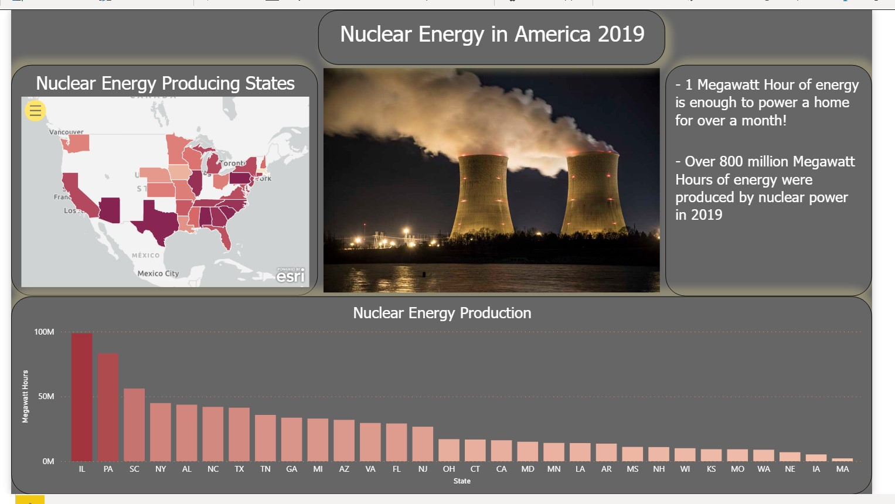

# Nuclear Energy in America 2019
> Which states have nuclear energy? How much are they producing? This is a dashboard that answers these questions. 

## Table of contents
* [General info](#general-info)
* [Screenshots](#screenshots)
* [Technologies](#technologies)
* [Features](#features)
* [Status](#status)
* [Inspiration](#inspiration)

## General info
This is my first PowerBI dashboard that I made as a student at Nashville Software School. 
I got my data from the US Energy Information Administration website (eia.gov). 
This data showed the energy production amount by all nuclear power plants by state, facility, and reactor for 2019. 
My question was: How much nuclear power are we making, and who is making it?

## Screenshots

## Technologies
* PowerBI - Version: 2.91.884.0 64-bit (March 2021)
* ArcGIS for PowerBI - Version 1.0.0.110
* Microsoft Excel - 2019

## Features
List of features ready and TODOs for future development
* Clicking on a state on the map highlights the state on the map and the bar graph
* Mousing over a state shows you the names of the power plants in a clickable tooltip
* The bar graph allows you to drill down on a state to see how many power plants are located in the state. You can drill down further to see how many
	reactors are at each plant, and how much power each produces

To-do list:
* Clean up the tooltip to make it easy to read and only one page per state
* Tweak the colors to be more consistent throughout

## Status
Project is: On hold. I want to come back to this and improve features and functionality to get more dashboarding practice.  

## Inspiration
My dad has spent his career in nuclear energy engineering, and I wanted to discover more about his field. 
